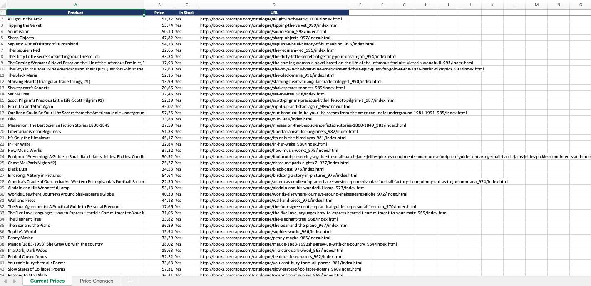

# Price Tracker — Web Scraper with Incremental Archive & Excel Reports


A production-style price monitoring tool. It scrapes product listings, keeps an
**incremental CSV archive**, detects **price changes** between runs, and produces a
**formatted Excel report** highlighting drops and increases.

Built to demonstrate a real scraping pipeline, not a toy script: stable product keys,
change detection, append-only history, and a clean separation between fetching, storage,
and reporting.

## What it does

- Scrapes paginated product listings (title, price, stock, URL)
- Maintains two CSV files:
  - `latest.csv` — current state of every product
  - `price_history.csv` — append-only log of **only** new products and price changes
- Generates `price_report.xlsx`:
  - **Current Prices** sheet — all products, currency-formatted
  - **Price Changes** sheet — drops in green, increases in red, new items in yellow
 
## Two fetch engines

The scraper supports two interchangeable fetch engines, selected with a single
setting in `config.py`:

- **`requests`** — fast and lightweight, for static sites where the HTML arrives complete.
- **`playwright`** — drives a real headless browser, for JavaScript-rendered sites where
  content is built on the client after the page loads. It waits for the target element
  (`wait_for`) before reading the HTML.

Only the fetch layer changes. Parsing, archiving, and reporting stay identical regardless
of engine — so the same pipeline handles both static and dynamic sites.

```python
# config.py
"engine": "requests",     # or "playwright"
"wait_for": "article.product_pod",
```

## Architecture

| File | Responsibility |
|------|----------------|
| `config.py` | All settings + the target site (single source of truth) |
| `scraper.py` | Fetch + parse — the only site-specific code |
| `store.py` | Incremental CSV archive + price-change detection |
| `report.py` | Excel report generation (openpyxl) |
| `main.py` | Orchestration / entry point |

## Quick start

```bash
pip install -r requirements.txt
python main.py
```

Output lands in `data/`. Run it again later and only changed prices are appended to the
history — that is what powers the price-change report.

## Pointing it at a real site

The pipeline is site-agnostic. To track a different store:

1. Update `TARGET` URLs in `config.py`
2. Update the CSS selectors in `scraper.py → parse_listing()`

Everything else (archiving, diffing, Excel) stays the same.

**JavaScript-rendered sites:** swap `requests` for Playwright in `scraper.fetch()` —
render the page, then pass the HTML to the same parser. The rest of the pipeline is unchanged.

## Notes

- Includes a polite request delay to respect the target server.
- The default target is `books.toscrape.com`, a sandbox built for scraping practice.
- Always review a site's Terms of Service and `robots.txt` before scraping it in production.
